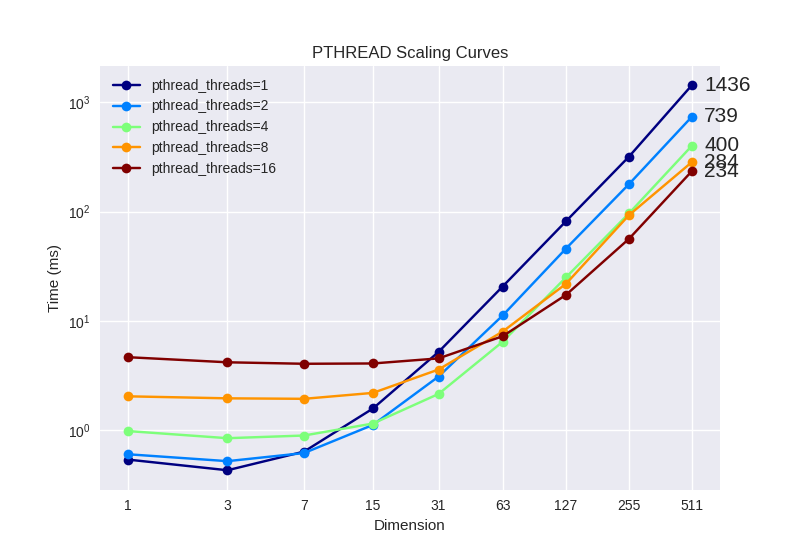

# Parallel implementations of the Particle Swarm Optimization (PSO) algorithm

### Levy function:

### Rastrigin function:

### Rosenbrock function:

## Parallel Experiments

> Note that we only use `Levy Function` to do our parallel experiments !

### Scaling space dimensions (number of particles = 3000)

Linear-scale x & y axes (without CPU data) : 

Log-scale x & y axes :

## Scaling number of particles (space dimension = 3000)

Linear-scale x & y axes (without CPU data) :

Log-scale x & y axes :

## Scaling number of threads

### OpemMP

Log-scale x & y axes :

### Pthread

Log-scale x & y axes :

## CUDA Experiments

Change the shape of the thread blocks and see the difference of performance.

* space dimension = 1024 
* number of particles = 1024 
* PSO iterations = 1000

| Block Shape | Exec Time (s) |
|  ----  | ----  |
| 256*1  |  0.4054610601005455 |
| 128*2  |  0.38019075666864716 |
| 64*4   |  0.3638322894771894 |
| 32*8   |  0.3968619456825157 |
| 16*16  |  0.30794164454564454 |
| 8*32   |  0.24697648656244078 |
| 4*64   |  0.2032000591357549 |
| 2*128  |  0.1980450333406528 |
| 1*256  |  0.19917888169487316 |

| Block Shape | Exec Time (s) |
|  ----  | ----  |
| 1*64   |  0.2076006976266702 |
| 1*128  |  0.19953426771486799 |
| 1*256  |  0.19917888169487316 |
| 1*512  |  0.20139076318591834 |
| 1*1024 |  0.21060395787159603 |

We can see that when block shape = (1, 256) or (2, 128), the cuPSO gets the best performance.